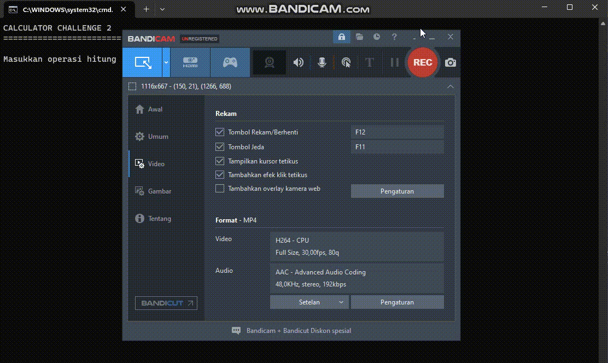
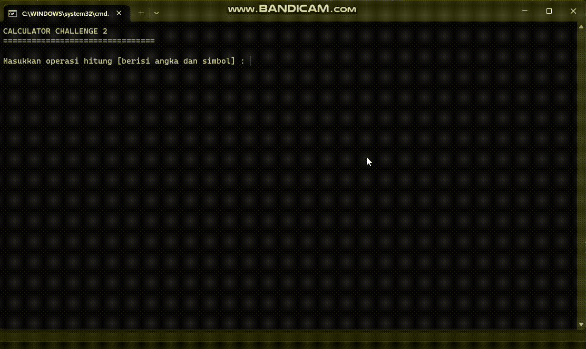

# kalkulator-challenge

Kalkulator challenge ini adalah pengembangan dari kalkulator versi sebelumnya yang pernah saya buat yaitu https://github.com/rhmau1/kalkulator-string-simbol
<br>
Dibawah ini akan saya tunjukkan contoh penggunaan kalkulator challenge 
<br> <hr>
## Contoh 
Pada saat __pertama kali__ menjalankan kalkulator ini user __harus__ menginputkan operasi hitung yang diakhiri dengan tanda `=` <br>
Dan saat ingin __melanjutkan__ perhitungan user __tidak perlu__ menambahkan tanda `=` pada akhir operasi hitung karena dapat menyebabkan eror
```
CALCULATOR CHALLENGE 2
================================

Masukkan operasi hitung [berisi angka dan simbol] : 9992 + 18 =
```
Apabila operasi perhitungan diatas dijalankan maka akan menghasilkan output sebagai berikut <br>
```
9992 + 18 = 10010
```
Apabila user ingin melanjutkan perhitungan maka cukup langsung menambahkan operasi hitung disamping hasil perhitungan yang awal. Contoh inputnya seperti ini
```
CALCULATOR CHALLENGE 2
================================

Masukkan operasi hitung [berisi angka dan simbol] : 9992 + 18 =
9992 + 18 = 10010-8888
```
Apabila input diatas dienter maka akan menghasilkan output seperti ini
```
10010 - 8888 = 1122
```
Untuk __keluar__ dari kalkulator ini user langsung menekan tombol silang yang terdapat pada bagian ujung kanan atas yang ada pada konsol.

<hr>

## Daftar simbol yang dapat digunakan untuk kalkulator ini 

| Simbol | Keterangan |
|--------|------------|
| + | Penambahan | 
| - | Pengurangan | 
| * | Perkalian | 
| : | Pembagian | 


## ver1 <br>




## ver2 <br>


